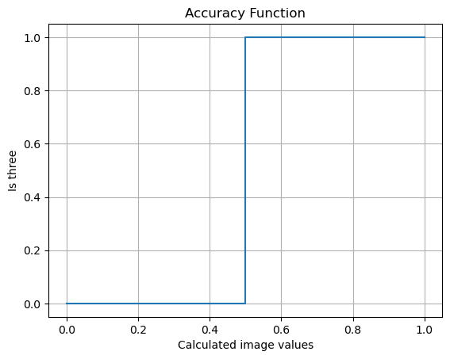
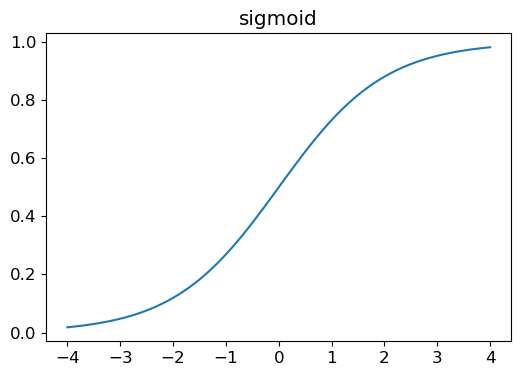
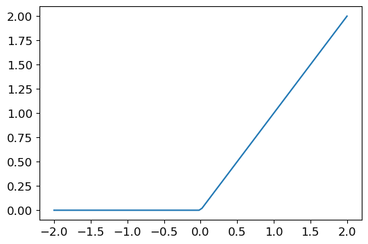

# MNIST From Scratch

Tensors are easy to work with and have human-friendly readout.

```
import torch

data = [[1,2,3],[4,5,6]]
tnsr = tensor(data)
tnsr.shape

out: tensor([2,3])
```
Can't use `tensor` as a variable name

## Benchmarking

Whenever designing a model you should first create a benchmark through traditional means with which you can compare your model to.

In the case of MNIST we simply gather the average of the numbers in question.  These look like


The distance of any given number from its corresponding mean image is the benchmark.

Our benchmark is 95%

## Broadcasting

PyTorch uses *broadcasting* to do operation with tensors of different sizes.  It will expand the tensor with the smaller rank to match the the tensor with the larger rank without actually allocating extra memory. 

*This is the most important technique for making efficient python code*

## Python Note

`.mean()` takes a tuple as an arg to specify the axes to take the mean on.  since our tensor is a stack of images we will use the (-1,-2) tuple to specify the last two axes which are the image height and width

## Implement a NN using SGD

### Step 1: Init Params

Gather training data into proper format (zip the flattened images with their labels)
do the same for validation data
Init the weights

decide the epochs and learning rate
    - Listening to the lex podcast with Jeremy and he believes that learning rate is largely not needed and can be automated away
        - basically, looking at the gradients and deciding the importance to give it on the fly.
        - Unsure how to implement this, could be worth looking into

### Step 2: Make the Predictions

Using a Linear1 operation (mat mul the weights to the training data using @ operator)

### Step 3: Calculate the Loss

This is a little tricky here since our loss function is essentially a step function.  



The gradient of Accuracy (A) will be like $\nabla A = 0 \; \text{where} \; \{x: x < 0.5, x > 0.5 \}\; \text{and} \; \nabla A = \infty \; \text{where} \; \{x: x = 0.5 \}$

Sort of making up my own notation here, lets see if I keep it consistent.  I am operating under the assumption that we are dealing with tensors here.  

These gradients are useless for updating our weights so we need a new loss function

The new loss function should have the following behavior: Score is a little higher is it is a 3 and score is a little lower if it is a 7

We use torch.where to achieve this (works just like np.where but speedy).  Because of our current implementation we need to ensure the values stay between 0 and 1.  This is where sigmoid comes in

sigmoid: $\frac{1}{1+e^{-x}}$



The gradient of a sigmoid will always be on the interval $(0,\infty)$

So the predictions get squashed between 0 and 1

Then taking the squashed predictions I pass them into the `.where` in the following way: `torch.where(trgt==1, 1-prds, prds)`. So if the target value is 1 (in this case would denote a 3) return the difference between 1 and the prediction.  The closer to 0 the better the prediction.  If the target does not equal 0 then return the prediction,which should already be closer to 0. 

Then take the mean of these value and you will have your mean loss

#### Note: On metrics and loss

The function of a metric is purely for human judgement.  We use metrics to judge the models performance.  However, the model uses loss to improve its performance.  Why does it use loss and not our metric?  Often, it is because the metric we are using is not differentiable in a way that is useful for updating weights as shown above. Loss is differentiable in a useful way.  Just looking at a Sigmoid graph will tell you that the gradient on any given point will be non-zero (non-infinite as well).  Metrics still play an important role, we must use our metrics to *judge* the model.  

What does this mean for us?  We must focus on the *metric* not the *loss* to inform us of the model performance.  

I wonder if it would be useful to devise metrics that closely resemble the loss so that the two are coupled in a meaningful way.   

#### Note: SGD and Mini-batches

We obviously want good performance during training which means thinking about speed.  We can't use the entire dataset every time we train, it would take too long.  We also can't update one weight at a time, this is imprecise as we would be using limited information causing the gradient to be unstable.  You could imagine some data points having extreme gradients, but get averaged out when grouped with other data points. 

What do we do? We compromise. We create mini-batches based on a *batch size* we determine before training.  The *batch size* determines the number of data points are used per *epoch*

We can use the dataloader class in FastAI for now.  I would like to write my own dataloader so I can understand how this works. 

takes any python data object and has the options to shuffle the data into batches with the `batch_size: int` and `shuffle: Bool` arguments

### Step 4: Calculate the Gradients

Calculate the predictions with your model.  In this case the linear1 model.  

Then calculate the loss. Apply the chain rule backwards up the computational graph.


### Step 5:  Step up the weights

update the parameters, set the gradients to 0

### Step 6: Rinse and repeat

Loop through steps 2-5

### Step 7:

Stop

#### Note: on the SimpleNN Class and Python Classes in General

My understanding of Python classes is poor.  My intuition is still based on static methods.  This led me to writing dependent definitions and repeating myself often.  I used GPT to help me form the class and I am getting a better handle on the intuition.  Also used GPT to write a short course on Python classes to help out.  


## Recap of the NN implementation

The basic model flow is as follows: 
    - Initialize the weights and bias
    - decide the epochs and learning rate
    - Then enter the training cycle
        - Make predictions
        - calculate loss
        - apply chain rule
        - Update the parameters
    - Stop

Motivations for some of the things we do here. Randomly initialize the weights and biases because it works just as good as define some start values. They need to be non-zero for the gradients to work.  Setting the epochs is really just how long you're willing to wait.  Setting the learning rate is a value representing the strength you give to the gradients on changing the weights and bias.  At this point I have not been given a reason we use sigmoid (or any other squishing function) other than "we often like to have values between 0 and 1".  I am assuming this will be elucidated soon enough.  As for the application of the chain rule, I'm confident of at least that.  We apply the chain rule which accumulates the gradients leading back to the first function the weights were used in which is the linear function.  What I am unsure of is *how* .backward does this.  I think my physics brain is getting in the way here.  After we collate the gradients (* the learning rate) we apply them to the parameters by subtracting them from the current parameter values.  This is the weight nudging, or pushing the blanket.  Just as a pragmatic step we then set the gradients to zero as PyTorch will continue collate the gradients on top of the old ones.  Then we stop the training when we get bored or the loss/accuracy fails to improve (or starts getting worse).

And thats really it, we now have a generalized structure for a Linear Classifier.  Some questions I have now are:
    - How can I extend this to include all single digits in the MNIST set?
    - How does .backward() actually work
    - Why do we use squishing functions in the general case?
        - Like what if we are classifying between many different digits? (relates to Q1)


## Using PyTorch function to simplify the process

We can use PyTorch to write an optimizer.  Generalizing the Simple LC class to take any model.

PyTorch linear performs slightly better than our implementation.

My current class is designed for one pass Linear classifier

Update the class to a two layer neural net

Need to completely change the class as it is too brittle to extend quickly.

Using the PyTorch functionality we can actually make a NN class.  

### A basic NN class


```
    class SimpleNN(nn.Module):
        def __init__(self, input_size, hidden_size, output_size):
            super(SimpleNN, self).__init__()
            self.linear1 = nn.Linear(input_size, hidden_size)
            self.ReLU = nn.ReLU()
            self.linear2 = nn.Linear(hidden_size,output_size)
                
        def forward(self, x):
            x = self.linear1(x)
            x = self.ReLU(x)
            x = self.linear2(x)
            return x
```


#### Note: on Linear functions

The composition of two (or more) linear functions can be described by a different single linear function with a new set of parameters that capture the same information.  This is why we use things like ReLU's or *rectified Linear unit*.



ReLU decouples any two linear functions from each other. This allows them to do useful work in their own right.  So in practice you need to put a non-linear function in between any two linear functions.  

## Extending the model to all digits

Right now what I have is a binary classifier.  I need to update the model to take into account 10 outputs. These 10 outputs would be predictions for each digit one of them being the wing guess.  

To do this I need to:

- Change the way I am loading the data
    - change the labels form 0 and 1 to $[0,9]$

- Change the loss function to support 2+ predictions
- Change the accuracy function to handle the new prediction space


Well, after a nice side quest finding the MNIST data, we can get started. I decided to grab it in the .csv form and made zipped test/validation/training data.

We will be using the Cross entropy loss function for multi-class classification

- First I will implement the binary formulation, then try the multi-class
- trying it on the Binary classifier
- Implemented BCELoss from scratch but ran into numerical instability with torch.log()
    - Get nan values often which screws things up
    - This was from $log(0) = \infty$
- Torch handles the instability automatically by "clamping" the prediction values
    - basically ensuring 0 is never used in log and instead some small value of epsilon (1e-7 ish).

- Implemented clamping and was able to train the model

#### Note: on Binary Cross Entropy

Binary Cross Entropy

$$\begin{align}
L_{i} = -\log_{}(p_{i}) + (1-y_{i})\log_{}(1-p_{i})\\ 
\text{where} \; p = \text{predicted value}, \\
\text{i} = \text{i-th sample}, \\
\text{and} \; y = \text{target value} \\
\end{align}$$

$$\begin{align}
\therefore \text{Binary Model Loss} = \sum_{i=0}^{N} L_{i} \\
\text{where} \; N = \text{number of samples} \\
\end{align}$$

Took sometime to figure but I eventually got the Multi-category Cross Entropy function all setup.   

#### Note: on Categorical Cross Entropy Loss

This loss is the combination of two functions: Softmax, and Cross entropy loss. Softmax is described as 

$$\begin{align}
\text{Softmax}(p_{i}) = \frac{e^{p_{i}}}{\sum_{c=1}^{C} e^{p_{c}}}\\ 
\text{where} \; p = \text{predicted value}, \\
\text{i} = \text{i-th sample}, \\ 
\text{c} = \text{label index}, \\
\text{C} = \text{number of label labels} \\
\end{align}$$

And Categorical Cross-Entropy is described as 

$$\begin{align}
L_{i} = -\sum_{c=0}^{C}y_{i,c}\log_{}(p_{i,c})\\ 
\text{where} \; p = \text{predicted value}, \\
\text{y} = \text{target value}, \\
\text{i} = \text{i-th sample}, \\ 
\text{c} = \text{label index}, \\
\text{C} = \text{number of labels} \\
\end{align}$$


$$\begin{align}
\therefore \text{ Multi-Category Model Loss} = \frac{-1}{N}\sum_{i=0}^{N}\sum_{c=0}^{C}y_{i,c}\log_{}(\text{Softmax}(p_{i,c})) \\
\text{where} \; N = \text{number of samples} \\
\end{align}$$

The inclusion of Softmax is to ensure no nan/infinite values I'm assuming.  

The practical implementation is further simplified by employing the one_hot tensor method.  This method is used to select only the prediction of the target value.  For example,

```
predictions = torch.tensor([0.7, 0.2, 0.4])

target = 0

one_hot = torch.zeros(predictions.shape[0])

one_hot[target] = 1.

print(one_hot)
# out: tensor([1., 0., 0.])

one_hot_predictions = one_hot * predictions

print(one_hot_predictions)
# out: tensor([0.7, 0., 0.])
```

This reduces our Categorical Cross Entropy to 

$$\begin{align}
L_{i} = -\log_{}(p_{i,k}) \\
\text{where} \; k = \text{index of target class}, \\ 
\text{and} \; i = \text{i-th sample}, \\ 
\text{and} \; p \; \text{is the soft maxed prediction}
\end{align}$$


$$\begin{align}
\therefore  \text{ Multi-Category Model Loss} = \sum_{i=0}^{N}L_{i} \\
\text{where} \; N = \text{number of samples} \\
\end{align}$$


Yes, I index from zero. fight me. Also, I dropped the normalization factor as all the implementations I saw didn't use it.  In practice, N will be the batch size.  After implementing the loss function I ran into an issue with the loss dropping to nan immediately after the first batch.  I (not so quickly) realized that my learning rate was set to 1, which was causing the model to diverge.  Fixing that resulted in a working MNIST digit classifier.  This was easier than I expected, however I am definitely looking forward to using some of the more refined tools PyTorch offers.


## !!! Forgot to benchmark the Multi-class model !!!

I've been pretty bummed about the performance of the multi digit model.  then I realized I was comparing the performance (accuracy) to the binary model!  Need to create a benchmark to compare against.  

Creating the benchmark flow took too long.  Once I was done I asked GPT to refactor using broadcasting and it turned by 20 plus lines into 10 by Broadcasting.  It's obvious that I need to have a better grasp on broadcasting.

The benchmark returned an accuracy of 66%.  My model performs at ~95% accuracy which is a significant improvement.  And here I can finally end this project. 

Time taken: 2 Days


